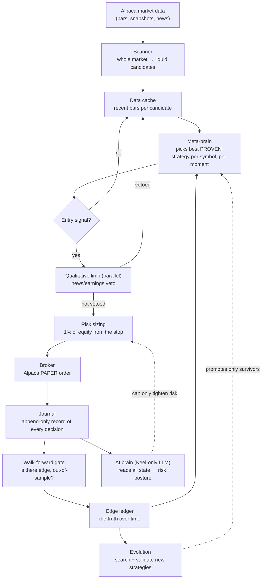
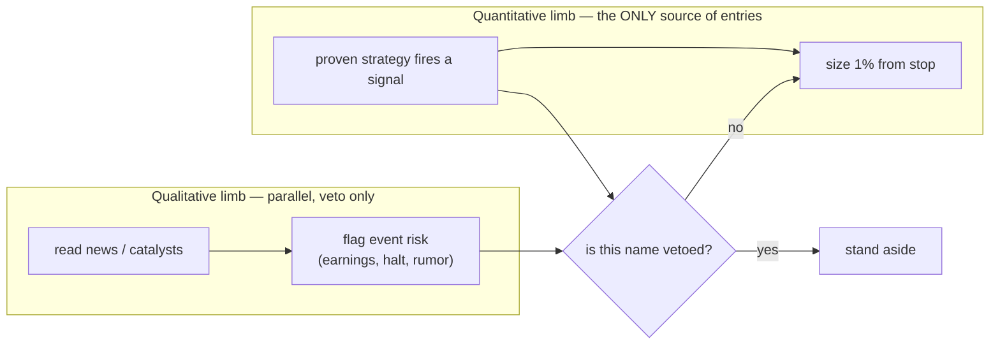
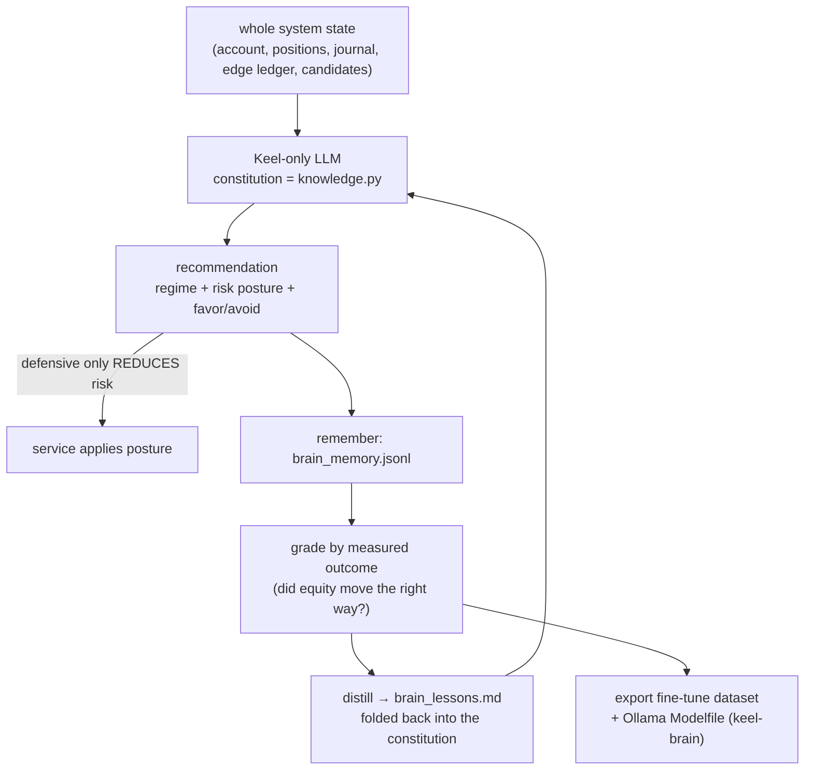
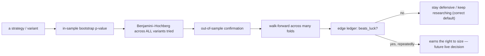

# Keel — Architecture (the whole machine, plainly)

This is the study map. It explains what every part does, how they connect, and
*why* the design is shaped this way. It is written to be understood, not
dumbed-down: if you read this top to bottom you can modify any part with
confidence.

> **Visual map:** open **`docs/system-map.html`** in any browser — a
> self-contained, offline wireframe of the whole machine, kept in step with the
> code. `docs/system-map.mmd` is the plain-text diagram source (also used to
> regenerate the optional FigJam board). All three — this doc, the HTML, and the
> `.mmd` — are updated in the same change as any architecture change.

The one idea that governs everything: **Keel is built to refuse a false edge.**
Trading systems don't usually fail from lack of cleverness — they fail because
they fool themselves into betting on noise. So every part of Keel is arranged so
that the only thing allowed to risk money is a strategy that has *proven itself
out-of-sample*, and everything smart (the meta-brain, the AI, the qualitative
limb) can only choose among proven things or make the system more careful. Smart,
never reckless.

---

## 1. The layers, from data to decision

The dotted arrows are the safety-bounded influences: the AI can only *tighten*
risk, evolution can only *add proven* strategies. Nothing on a dotted line can
loosen a limit or invent an edge.

---

## 2. What each module is (the code map)

| Module | Plain-English job |
|---|---|
| `data.py` | Validated OHLCV bars. Rejects bad data at the door; `upto(i)` is the only view a strategy ever sees, so look-ahead is impossible. |
| `universe.py` | Point-in-time membership — who was tradeable *on a past date*. Kills survivorship bias structurally. |
| `indicators.py` | Causal EMA / RSI / ATR / session helpers. Every value at bar *i* uses only bars up to *i*. |
| `strategy.py` / `strategies.py` | The playbook: `rsi2` (intraday mean reversion), `orb` (opening-range breakout), `swing` (trend pullback). Each answers "enter / hold / exit" for one bar. |
| `signals.py` / `ensemble.py` | The RenTech pivot: many weak signals scored 0–1, blended into one conviction. The ensemble runs through the same gate as any strategy — the *combiner* is what gets validated. |
| `allocator.py` | Cross-sectional book — rank candidates by conviction and give each an equal slice of the risk budget (many small bets). |
| `meta.py` | The **meta-brain**: for each symbol, scores each strategy/ensemble on its recent behaviour and routes the decision to the best-fitting one. Re-selects as the regime shifts; never mid-trade. |
| `decay.py` / `riskbudget.py` / `stress.py` | Auto-retire fading edges; portfolio exposure + drawdown limits; honest gap-aware stress tests. |
| `certify.py` / `synthesize.py` | The gate as a service (certify any target); safe self-writing (the LLM proposes bounded ensemble specs, never code). |
| `briefing.py` | The three-question honest briefing: is there edge, what did it do, what is it worried about. |
| `backtest.py` | Single-symbol walk-forward engine: next-open fills, gap-aware stops, costs on every fill. |
| `portfolio.py` | Multi-symbol engine — the live trading logic in backtest form: many trades/day, turnover throttles, no leverage. |
| `risk.py` | Fixed-fractional sizing from the stop. A **constant**; nothing may change it. |
| `costs.py` | Realistic per-fill cost model. High turnover makes costs the enemy; this keeps the backtest honest. |
| `stats.py` | The judge: stationary block-bootstrap null + Benjamini–Hochberg FDR. This is what can say "no". |
| `roster.py` | **Evolution**: searches strategy variants, validates with train/test + FDR, writes the champion/survivors. |
| `walkforward.py` | The gate: does the *adaptive process* make money out-of-sample? Writes the edge ledger. The one number that gates real money. |
| `scanner.py` + `catalysts.py` | Whole-market liquidity ranking + real news feed. |
| `overlay.py` | The **qualitative limb** — veto-only. Flags candidates with event risk; can never create a trade. |
| `brain.py` + `knowledge.py` + `training.py` | The **AI brain**: a Keel-only LLM that reads all state and sets risk posture; its knowledge is a constitution; it learns from graded outcomes. |
| `broker.py` | Alpaca **paper** client. No code path to live money. |
| `trader.py` | The live loop body: scan → decide → size → order → manage → flatten, with arm/kill and throttles. |
| `service.py` | The always-on orchestrator: schedules scan, brain, overlay, and each `tick`. Starts when you open the app. |
| `ui.py` / `app.py` | The monitor (watch-only, one KILL switch) and the desktop launcher. |
| `doctor.py` | One-command honest status of the whole machine. |

---

## 3. The two limbs (why trades are both quantitative and qualitative)

The quant limb decides *whether there is a trade*. The qualitative limb can only
*remove a name from consideration*. This mirrors a real desk: the system finds
candidates, the news overlay dodges the landmines a chart can't see. "News alpha"
is never allowed to open a position, because it can't be validated the way the
gate validates the quant playbook.

---

## 4. The brain and its training loop (self-improvement that can't self-destruct)

The training signal is the **measured outcome**, never vibes. The brain learns to
be *right*, not *confident*. And by construction it can only ever make the system
more careful or pick among already-proven strategies — the honesty spine survives
training intact.

---

## 5. The honesty gate (the spine)

`keel doctor` reads the end of this pipeline and tells you the truth in one line —
including "no proven edge yet," which is the honest state most of the time and is
a feature, not a failure.

---

## 6. How to study, better, or remove things

- **Add a strategy:** implement the `Strategy` contract in `strategies.py`, add it
  to the `VARIANTS` search in `roster.py`, run `keel evolve` + `keel walkforward`.
  It only reaches live selection if it survives the gate.
- **Change what "best strategy now" means:** edit `MetaStrategy._score` in
  `meta.py` (currently recent realized return). Then re-validate with
  `walk_forward` — the meta-policy is itself judged out-of-sample.
- **Tune the qualitative veto:** edit `overlay.py`'s prompt/parse. It can only ever
  produce an avoid-list; that boundary is enforced in `parse_overlay`.
- **What you must NOT weaken:** `risk.py` sizing, the paper-only boundary in
  `broker.py`, and the "veto-only / tighten-only" bounds in `overlay.py` and
  `brain.py`. These are the spine; everything else is fair game.
- **See the whole state:** `keel doctor --network`.

The rule for every change: *does it let the machine risk money on something
unproven?* If yes, it's wrong, however clever. If no, improve away.
